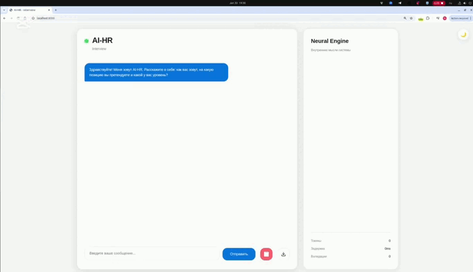
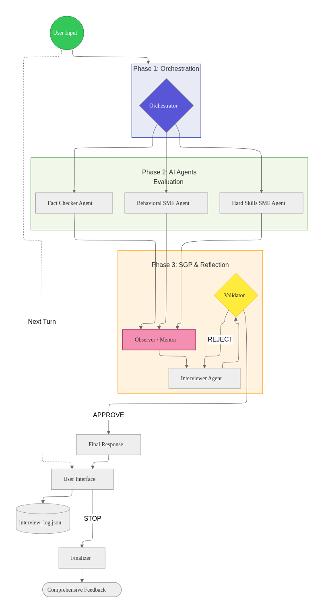

<div align="center">

# 🤖 NodeHR

**AI Interview System | Multi-Agent Architecture**

[](http://104.128.135.93:8000/)
[](./docker-compose.yml)
[](https://www.python.org/)

</div>

---

Семь AI-агентов работают как единая команда, проводя технические интервью нового уровня. Система не просто задает вопросы — она анализирует ответы в реальном времени, выявляет пробелы в знаниях и сразу предлагает образовательный контент. Результат: не просто оценка, а персональная дорожная карта развития для каждого кандидата.

Архитектура на LangGraph превращает каждый диалог в трехфазный процесс: параллельная экспертиза, глубокая рефлексия и адаптивная генерация вопросов. Уникальность — полная прозрачность: вы видите внутренние мысли всех агентов, понимая, как система принимает решения на каждом шаге.

---

<div align="center">



**[🌐 Попробовать демо →](http://104.128.135.93:8000/)**

</div>

---

## 🚀 Быстрый старт

```bash
git clone <repository-url>
cd node-hr
cp env.example .env
```

Добавьте ваш `MISTRAL_API_KEY` в `.env`:

```env
MISTRAL_API_KEY=your_mistral_api_key_here
```

Запустите через Docker Compose:

```bash
docker compose up -d --build
```

Приложение будет доступно на `http://localhost:8000`

### ⚙️ Управление

```bash
# Остановка
docker compose down

# Перезапуск
docker compose restart

# Просмотр логов
docker compose logs -f nodehr

# Обновление после изменений
git pull
docker compose up -d --build
```

---

## 🛠️ Технологический стек

### Backend
- **Python 3.11** — основной язык разработки
- **FastAPI** — современный асинхронный веб-фреймворк
- **Uvicorn** — ASGI-сервер для запуска приложения
- **WebSockets** — real-time коммуникация с фронтендом

### AI/ML
- **Mistral AI** — LLM для генерации ответов и анализа
- **LangGraph** — построение state machine для мультиагентных систем
- **LangChain** — интеграция с LLM и управление промптами

### Архитектура
- **Clean Architecture** — разделение на слои (API → Core → Storage)
- **State Machine** — управление workflow через LangGraph
- **Dependency Injection** — через FastAPI Depends

### Инфраструктура
- **Docker** — контейнеризация приложения
- **Docker Compose** — оркестрация сервисов
- **Pydantic** — валидация данных и настройки

### Frontend
- **Vanilla JavaScript** — без фреймворков, чистый JS
- **WebSocket API** — real-time обновления
- **CSS3** — современные стили с glassmorphism эффектами

---

## 🏗️ Архитектура

Система построена на принципах Clean Architecture с четким разделением слоев: API, Core и Storage. В основе — LangGraph state machine, который управляет сложным workflow интервью через последовательность узлов: Orchestrator → Expert Pool → Observer → Interviewer → Validator → Finalizer.

**Multi-Agent Pipeline:**

| Агент | Роль                                                                                  |
|-------|---------------------------------------------------------------------------------------|
| 🎯 **Orchestrator** | Извлекает профиль кандидата и определяет готовность к техническому интервью           |
| 👥 **Expert Pool** | Параллельная оценка тремя экспертами (Hard Skills Specialist, HR Agent, Fact Checker) |
| 👁️ **Observer** | Анализирует данные экспертов и создает скрытые инструкции для интервьюера             |
| 💬 **Interviewer** | Генерирует адаптивные вопросы на основе инструкций                                    |
| ✅ **Validator** | Проверяет качество ответа и может вернуть к Interviewer для улучшения                 |
| 📊 **Finalizer** | Генерирует comprehensive feedback с decision, skills matrix, knowledge gaps и roadmap |

<div align="center">



</div>

---

## 🧠 Методологии мультиагентных систем

NodeHR реализует современные подходы из области мультиагентных систем и AI-координации:

### 🔄 SGR (Schema-Guided Reasoning)

**Schema-Guided Reasoning** — методология, где модель без встроенных навыков рассуждения заставляется думать через структурированную схему вывода (structured output). В NodeHR каждый агент получает четкую JSON-схему желаемого результата:

- **Orchestrator**: Схема с полями `name`, `position`, `grade`, `experience`, `ready_for_technical`
- **Python Specialist**: Схема с `technical_accuracy` (1-10) и `notes`
- **Fact Checker**: Схема с `has_hallucinations`, `warning`, `detected_issues`, `severity`
- **HR Agent**: Схема с `communication_score` и `observations`
- **Observer**: Схема с `hidden_instructions`, `sentiment`, `guidance`, `difficulty_adjustment`
- **Interviewer**: Схема с `response`, `question`, `tone`
- **Validator**: Схема с `approved`, `quality_score`, `feedback`

Эти схемы заставляют модель проходить через структурированные шаги рассуждения, что приводит к более качественным, последовательным и предсказуемым результатам, чем свободная генерация текста.

### 🔁 Reflection Loop (Observer → Interviewer → Validator)

**Phase 3** системы реализует цикл рефлексии для улучшения качества генерации:

- **Observer**: Анализирует результаты экспертизы и создает скрытые инструкции
- **Interviewer**: Генерирует адаптивный ответ на основе инструкций
- **Validator**: Оценивает качество и может вернуть к Interviewer для улучшения

Этот цикл позволяет системе самоулучшаться: если Validator отклоняет ответ, Interviewer получает обратную связь и генерирует улучшенную версию.

### 👥 Expert Pool Pattern

Параллельная экспертиза через **Expert Pool** — паттерн, где несколько специализированных агентов одновременно анализируют один и тот же вход:

- **Python Specialist**: Оценивает техническую точность (hard skills)
- **HR Agent**: Анализирует коммуникацию и soft skills
- **Fact Checker**: Обнаруживает галлюцинации и противоречия

Все эксперты работают параллельно через `asyncio.gather()`, что ускоряет обработку и обеспечивает многогранную оценку.

### 👁️ Observer Pattern с Hidden Instructions

**Observer** действует как "ментор", который:
- Анализирует sentiment кандидата
- Адаптирует сложность вопросов (difficulty adjustment)
- Создает скрытые инструкции для Interviewer
- Обрабатывает предупреждения от Fact Checker

Это позволяет Interviewer получать контекстную информацию без прямого доступа к сырым данным экспертов.

### ✅ Validation Loop

**Validator** реализует цикл валидации с ограниченным количеством попыток:
- Проверяет качество ответа Interviewer
- При отклонении возвращает к Interviewer с обратной связью
- После максимального количества попыток продолжает выполнение

Это предотвращает бесконечные циклы и обеспечивает прогресс даже при сложных случаях.

### 🎯 State Machine Architecture

Вся система построена на **LangGraph State Machine**, что обеспечивает:
- Детерминированное выполнение workflow
- Условные переходы между узлами
- Сохранение состояния между turns
- Прозрачность процесса принятия решений

### 🔀 Conditional Routing

**Orchestrator** использует условную маршрутизацию:
- Может зацикливаться для сбора недостающей информации
- Завершает выполнение при ожидании ответа пользователя
- Переходит к экспертизе при готовности профиля

Это делает систему адаптивной к различным сценариям интервью.

---

## 🎯 Точки роста

### 🔜 Ближайшие улучшения

- 🔍 Интеграция с векторными базами данных для RAG-поиска по технической документации
- 📄 Экспорт отчетов в PDF с визуализацией метрик
- 📊 Система рейтингов и сравнения кандидатов

### 🚀 Долгосрочное развитие

- 🌍 Мультиязычная поддержка интервью
- 🔗 Интеграция с ATS-системами (Applicant Tracking Systems)
- 🎥 Видео-интервью с анализом невербальных сигналов
- 📚 Персонализированные обучающие программы на основе knowledge gaps
- 👥 Коллаборативный режим для командной оценки кандидатов

---

## 📚 Дополнительная информация

### 🔐 Переменные окружения

```env
MISTRAL_API_KEY=your_mistral_api_key_here
MISTRAL_MODEL=mistral-large-latest
APP_NAME=AI-HR
APP_ADDRESS=0.0.0.0
APP_PORT=8000
LOG_DIR=logs
MAX_VALIDATION_ATTEMPTS=3
```

### 🌐 Настройка Nginx (опционально)

Для использования домена и HTTPS:

```nginx
server {
    listen 80;
    server_name your-domain.com;

    location / {
        proxy_pass http://localhost:8000;
        proxy_http_version 1.1;
        proxy_set_header Upgrade $http_upgrade;
        proxy_set_header Connection "upgrade";
        proxy_set_header Host $host;
        proxy_set_header X-Real-IP $remote_addr;
        proxy_set_header X-Forwarded-For $proxy_add_x_forwarded_for;
        proxy_set_header X-Forwarded-Proto $scheme;
    }
}
```

### 🔌 API Endpoints

**WebSocket:**
```
ws://localhost:8000/api/v1/interview/ws
```

**REST API:**
```
GET /api/v1/interview/download-log?session_id=<session_id>
```

### 🔒 Безопасность

- ✅ API ключи хранятся в `.env` (не коммитятся в git)
- ✅ Непривилегированный пользователь в Docker
- ✅ CORS настроен для production
- ✅ Валидация всех входных данных через Pydantic

---

<div align="center">

**NodeHR** — где искусственный интеллект встречается с человеческим подходом к найму.

Made with ❤️ using LangGraph & Mistral AI

</div>
